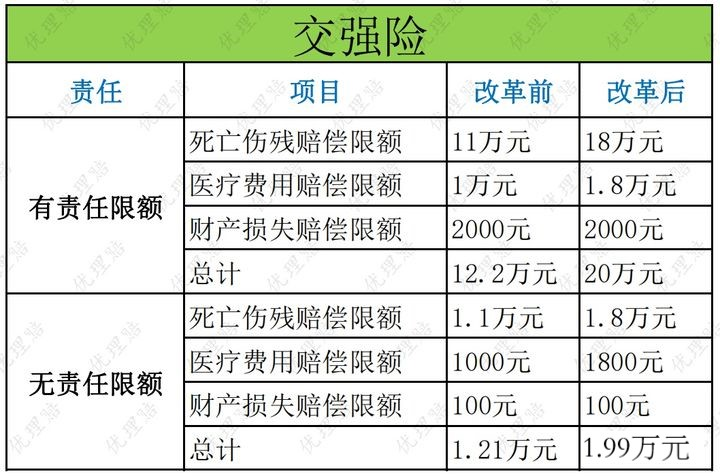
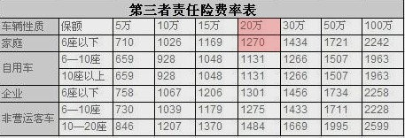

<!--
 * @Author: YCL
 * @Date: 2021-07-31 11:51:56
 * @LastEditTime: 2021-07-31 13:55:21
 * @LastEditors: Author YCl
 * @Description: 
 * @FilePath: \MLVue\html\normatest\insurance.md
-->
# 汽车保险业务
## 1.交强险(交通事故责任强制保险)
    详情:<上路必需买的保险><赔付他人人员伤亡车辆损失><独立险种>
    费用：950元(固定)
    作用：赔付第三者伤、亡、财产损失
    赔付标准如下：

## 2.三者险(第三者责任险)
    详情：<商业保险自行购买><赔付他人人员伤亡车辆损失><独立险种>
    费用：按赔付金额5w-100w++计算，不出险下一年价格降低(非固定)
    作用：赔付第三者伤、亡、财产损失
    赔付标准如下：
    <注：红色标注为普通家用5座轿车默认保险类型>

## 3.车损险(车辆损失险)
    <商业保险自行购买><赔付自己车辆损失><非独立险种>
    费用：每年按车辆现有自身价值计算(非固定)
    如:<车辆价值15w价格2000元、车辆价值20w价格2500元>
    作用：赔付自己车辆损失
    赔付标准：全额赔付
    改革后包含险种：全车盗抢险、玻璃单独破损险(车灯、天窗、后视镜除外)、不计免赔特约险(不计免赔率全额赔付)、自燃损失险(人为因素不赔付)、无过责任险、车身划痕险、涉水险(二次点火不赔发动机)、无法找到第三方特约险。

## 4.座位险(车上人员责任险)
    <商业保险自行购买><赔付自己车辆上的人员伤亡><独立险种>
    费用：一座50元，默认购买2座共计100元(非固定)
    作用：赔付自己车辆上的人员伤亡
    赔付标准：依据伤亡情况赔付
